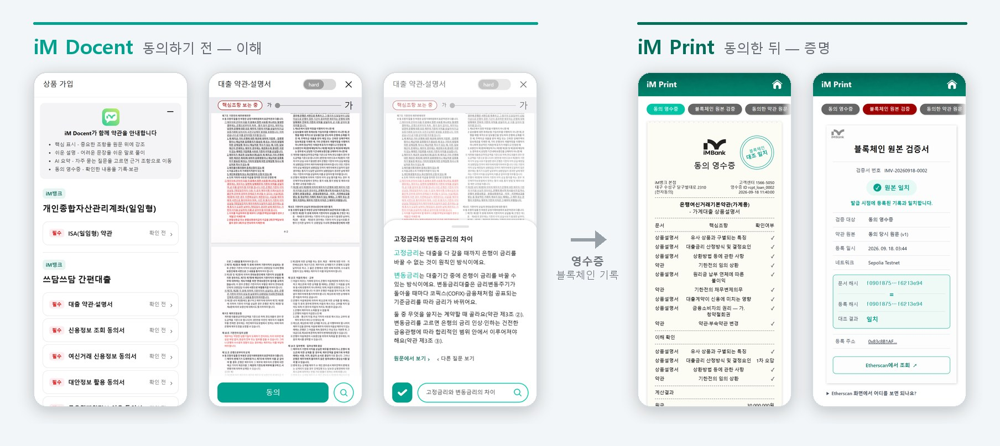
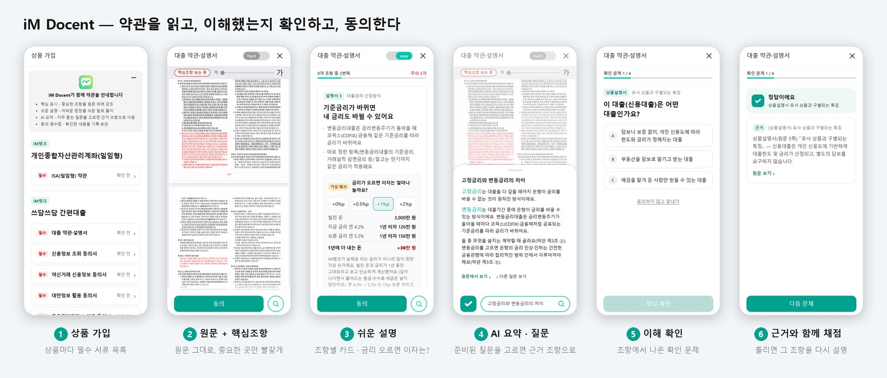
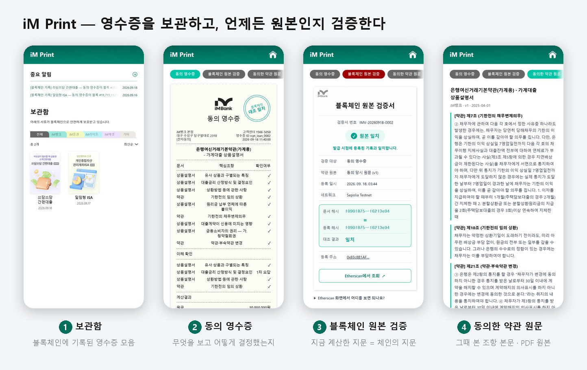
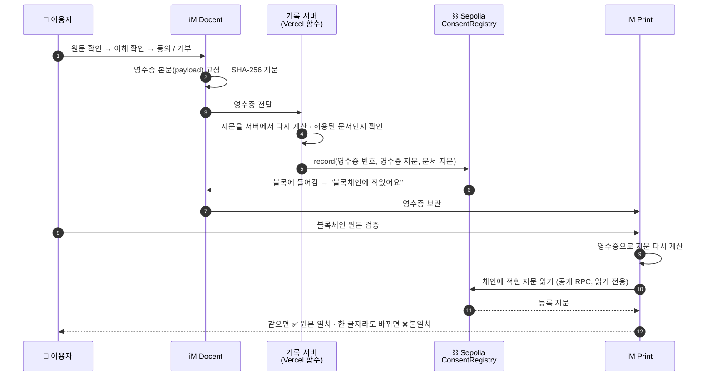
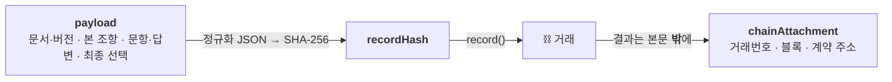
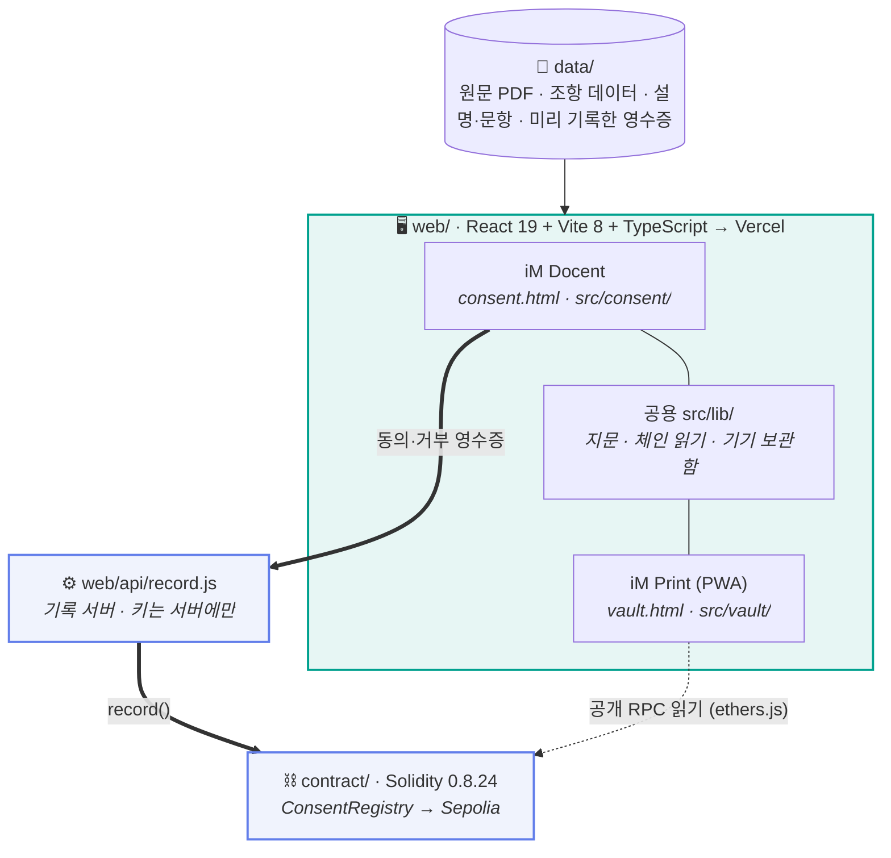

<div align="center">

# 🧾 동의 영수증 — iM Docent · iM Print

### 결제에는 영수증이 있는데, 왜 약관 동의에는 영수증이 없을까

**iM Docent**가 어려운 금융 약관을 원문 그대로 짚어 주고 이해했는지 확인하면,
무엇을 보고 어떻게 결정했는지가 **동의 영수증**으로 남고 그 지문이 **블록체인**에 기록됩니다.
**iM Print**는 그 영수증을 보관하고, 언제든 "그때 그대로인지" 검증합니다.

<br>


[](https://i-magine-yzla.vercel.app/consent.html)
&nbsp;
[](https://i-magine-yzla.vercel.app/vault.html)
&nbsp;
[](https://sepolia.etherscan.io/address/0x83c8B1AF7A0D215Bcd9c744F16Bf05B9AFCBBAEe#events)

<sub>휴대폰으로 여는 것을 권합니다 · 설치 없이 바로 열립니다 (iM Print 는 Safari → 공유 → 홈 화면에 추가로 앱처럼 설치 가능)</sub>

<br><br>



</div>

---

**목차** &nbsp; [💡 문제와 해결](#-문제와-해결) · [📱 두 앱](#-두-앱) · [⛓️ 블록체인 검증](#️-블록체인-검증은-이렇게-동작합니다) · [🏗️ 구조](#️-구조) · [📊 구현 현황](#-구현-현황) · [🚀 실행](#-실행-방법) · [🧪 테스트](#-테스트) · [👥 팀](#-팀)

---

## 💡 문제와 해결

<table>
<tr>
<th width="50%">🚫 지금</th>
<th width="50%">✅ 동의 영수증</th>
</tr>
<tr valign="top">
<td>

**무엇에 동의했는지 모른다**
대출 한 건에 약관·설명서·동의서가 여러 장. 대부분 읽지 않고 "전체 동의"를 누릅니다.

**동의했다는 사실을 증명하기 어렵다**
분쟁이 생기면 기록은 금융회사 서버에만 있고, 그 기록이 바뀌지 않았다는 걸 **회사가 스스로** 증명해야 합니다.

</td>
<td>

**이해하고 동의한다 — iM Docent**
원문은 그대로 두고 중요한 조항만 빨갛게, 쉬운 말 설명, 확인 문제로 이해를 점검합니다.

**동의를 증명한다 — iM Print**
영수증의 지문(SHA-256)을 공개 블록체인에 기록합니다. 누구든 **다시 계산해서 대조**할 수 있어, 금융회사를 믿지 않아도 검증됩니다.

</td>
</tr>
</table>

> 📰 **왜 중요한가** — 카카오페이 → 알리페이 고객정보 이전 사건에서 법원은 "이용자 동의가 없었다"고 보고 과징금(약 60억 원)을 유지했습니다.
> 쟁점은 **동의를 입증할 수 있는가**였습니다. ([파이낸셜뉴스 2026.06.11](https://www.fnnews.com/news/202606111515561392))

---

## 📱 두 앱

| | **iM Docent** — 동의하기 전 | **iM Print** — 동의한 뒤 |
|---|---|---|
| 역할 | 약관을 읽고, 이해했는지 확인하고, 동의·거부 | 영수증을 보관하고, 원본인지 검증 |
| 형태 | iM뱅크 앱 안의 약관 화면 (설치 없음) | 홈 화면에 설치하는 앱 (PWA) |
| 주소 | [consent.html](https://i-magine-yzla.vercel.app/consent.html) | [vault.html](https://i-magine-yzla.vercel.app/vault.html) |

### iM Docent



- **원문 그대로 + 핵심조항 강조** — 실제 iM뱅크 약관 PDF 위에, 결과가 고객에게 돌아오는 조항만 빨갛게 표시합니다. 글자 크기 조절.
- **쉬운 설명(easy)** — 조항마다 쉬운 말 카드. 대출은 "금리가 1%p 오르면 1년 이자가 얼마나 늘까" 계산 카드.
- **AI 요약 · 준비된 질문** — 자유 입력창은 없습니다. 원문에서 뽑은 요약과 질문을 **고르기만** 하고, 답은 근거 조항으로 이어집니다.
- **이해 확인** — 조항에서 나온 문제. 틀리면 그 조항을 다시 설명하고 **다른 문제로** 한 번 더 확인합니다.
  끝까지 풀면 "N문제 중 M문제를 틀렸어요"를 보여 주고 **동의 여부는 이용자가** 정합니다. 거부해도 영수증은 발급됩니다.

### iM Print



- **동의 영수증** — 어떤 문서의 어떤 조항을 보고, 문제를 어떻게 풀고, 무엇을 결정했는지. QR을 찍으면 체인 기록이 열립니다.
- **블록체인 원본 검증** — 화면의 영수증으로 지문을 **지금 다시 계산**해서 체인에 적힌 지문과 비교합니다. 같으면 "원본 일치".
- **동의한 약관 원문** — 그때 본 조항 본문과 PDF 원본을 그대로 다시 봅니다.

### 시연 상품 — 전부 실제 iM뱅크 문서

| 상품 | 원문 | 핵심조항 |
|---|---|:---:|
| 개인종합자산관리계좌(ISA, 일임형) | ISA(일임형) 약관 | 6 |
| 쓰담쓰담 간편대출 | 은행여신거래기본약관(가계용) + 가계대출 상품설명서 | 9 |
| 〃 신청 서식 6종 | 신용정보 조회·제공 동의서 등 (팀원이 실제 신청하며 받은 서식, 개인정보는 가림) | 서식별 |

> 지어낸 예시 약관·예시 영수증은 쓰지 않습니다. 원문 PDF 는 [`data/raw/documents/`](data/raw/documents/)에 있습니다.

---

## ⛓️ 블록체인 검증은 이렇게 동작합니다



<table>
<tr>
<th width="33%">🔐 체인에 올리는 것</th>
<th width="33%">🙅 올리지 않는 것</th>
<th width="33%">🔍 누구나 확인</th>
</tr>
<tr valign="top">
<td>

- 영수증 번호의 지문
- 영수증 지문 (SHA-256)
- 약관 원문 지문
- 문서 이름·버전

</td>
<td>

- 이름·연락처 등 개인정보
- 답변 내용
- 약관 원문 전체

→ 체인에서 지워지지 않아도 개인정보 문제가 생기지 않습니다

</td>
<td>

- [ConsentRegistry 계약](https://sepolia.etherscan.io/address/0x83c8B1AF7A0D215Bcd9c744F16Bf05B9AFCBBAEe#events)
- Etherscan 의 `Topics[1]` = 영수증 번호 지문,
  `Data` 첫 줄 = 영수증 지문
- iM Print 검증서에 보는 법 안내

</td>
</tr>
</table>

**왜 블록체인인가** — 회사 DB에 남긴 기록은 "고치지 않았다"를 회사가 증명해야 합니다. 공개 체인에 지문을 남기면 **고객과 회사가 같은 기록을 각자 확인**할 수 있고, 약관 원문 지문까지 함께 남아 **무엇에** 동의했는지도 고정됩니다.

> ⚠️ 지문은 "내용이 같은가"를 비교하는 값입니다. 설명의 법적 정확성·본인확인·전자서명의 법적 효력까지 증명한다고 주장하지 않습니다.

<details>
<summary><b>🔬 영수증 구조와 지문 규칙 (펼쳐보기)</b></summary>

<br>



- 지문 대상은 `payload` 뿐입니다. 거래번호를 나중에 붙여도 이미 기록한 지문이 바뀌지 않습니다.
- 브라우저(JS)·기록 서버·기록 스크립트·Python 이 **같은 바이트**를 만들어야 합니다 → 키 정렬, 공백 없는 구분자, 한글 그대로, 소수(float) 금지.
- [`web/src/lib/canonical.ts`](web/src/lib/canonical.ts) · [`api/hashing.py`](api/hashing.py) · [`tests/test_canonical_hash.py`](tests/test_canonical_hash.py)(교차 검증)

</details>

---

## 🏗️ 구조



- 이용자에게 지갑·가스비·네트워크 전환이 없습니다. 기록은 서버가, 화면은 **읽기만** 합니다.
- 두 앱은 지문 계산 코드를 **한 벌**만 씁니다 — 두 앱이 다른 지문을 내면 검증이 깨지기 때문입니다.
- 앱은 실행 중 AI를 호출하지 않습니다. 쉬운 설명·요약·문항 초안은 개발 중 Claude 로 만들고, 원문과 대조해 고정했습니다.

```
├── web/        두 앱 (React) · 기록 서버(web/api) · e2e 점검
├── contract/   ConsentRegistry (Solidity + Hardhat) · 배포/기록 스크립트
├── data/       raw(원문 PDF) · documents(조항 데이터) · content(설명·문항) · receipts(미리 기록한 영수증)
├── scripts/    원문 → 조항·강조 좌표 추출, 페이지 이미지 생성
├── api/        FastAPI · 지문 규칙 Python 구현 (교차 검증용)
├── tests/      pytest — Python 지문 == JS 지문
└── docs/       시연 순서(DEMO) · 운영(RUNBOOK) · README 이미지
```

---

## 📊 구현 현황

<sub>2026-09-19 기준</sub>

| 영역 | 상태 | 내용 |
|:---|:---:|:---|
| iM Docent | 🟢 배포 | 메인(상품별 필수 서류) → 원문·핵심조항 → 쉬운 설명·금리 계산 → AI 요약·질문 → 이해 확인 → 동의/거부 → 영수증 |
| iM Print | 🟢 배포 | 중요 알림 · 보관함 · 영수증 · 블록체인 원본 검증 · 약관 원문/PDF. 홈 화면 설치(iOS Safari) 확인 |
| 앱에서 바로 기록 | 🟢 동작 | 동의·거부하면 기록 서버가 Sepolia 에 적고, 블록에 들어간 뒤에만 "적었어요" 표시 |
| 스마트컨트랙트 | 🟢 배포 | [`0x83c8…BAEe`](https://sepolia.etherscan.io/address/0x83c8B1AF7A0D215Bcd9c744F16Bf05B9AFCBBAEe) — 같은 번호 재기록 불가, 원본/변경본 대조 |
| 제출용 오프라인 빌드 | 🟢 동작 | 서버 없이 HTML 더블클릭으로 두 앱 실행 (체인 대조는 인터넷 필요) |
| 설명·문항 콘텐츠 | 🟡 AI 초안 | 원문 조항 기준으로 작성, 사람 검수 진행 중 |
| 약관 개정 알림 | ⚪ 데이터 없음 | 기능은 있으나 같은 약관의 개정 전·후 원문이 필요 (지어내지 않음) |

---

## 🚀 실행 방법

**바로 보기** — [iM Docent](https://i-magine-yzla.vercel.app/consent.html) · [iM Print](https://i-magine-yzla.vercel.app/vault.html) (설치·로그인 없음)

**내 컴퓨터에서**

```bash
git clone <이 저장소 주소>
cd web
npm install
npm run dev              # http://localhost:5173/consent.html · /vault.html
npm run build:offline    # web/dist-offline/ 의 1_iM_Docent.html · 2_iM_Print.html 을 더블클릭으로 실행
```

환경변수가 없어도 두 앱은 뜹니다(기록만 "실패"로 표시). 체인 기록까지 하려면 [`web/.env.example`](web/.env.example)의 `RECORDER_PRIVATE_KEY`(테스트넷 전용 지갑)가 필요합니다.
배포·기록 절차는 [런북](docs/RUNBOOK.md), 시연 순서는 [DEMO](docs/DEMO.md)에 있습니다.

---

## 🧪 테스트

| 명령 | 개수 | 지키는 것 |
|---|:---:|---|
| `cd web && npm test` | 36 | 이해 확인 규칙 · 금리 계산 · 기록 서버 지문 == 앱 지문 == 스크립트 지문 · 강조 좌표가 원문 안에 있는지 |
| `cd web && npm run e2e` | 28 | 실제 브라우저로 두 시연 끝까지 · 거부 · 오답 · 큰 글씨(360px) · iM Print 체인 대조 (`--record` 는 실제 Sepolia 기록까지) |
| `cd contract && npx hardhat test` | 8 | 재기록 거부 · 빈 지문 거부 · 원본/변경본 대조 · 약관 v1/v2 대조 |
| `pytest` | 6 | Python 지문 == Node 지문 (한글·중첩·float 거부) |

---

## 🛠️ 기술 스택

| | |
|---|---|
| 화면 | React 19 · Vite 8 · TypeScript · PWA(서비스워커) |
| 블록체인 | Solidity 0.8.24 · Hardhat · ethers.js · Ethereum Sepolia |
| 기록 서버 | Vercel Functions (Node) |
| 지문 | 정규화 JSON + SHA-256 (JS · Python 동일 구현) |
| AI | Claude — 개발 중 쉬운 설명·요약·문항 초안 작성 (실행 중 호출 없음) |
| 원문 처리 | PyMuPDF — PDF 페이지 이미지, 조항 위치(빨간 강조 좌표) 추출 |

---

## 👥 팀

| 역할 | 이름 | 맡은 일 |
|:---:|:---:|---|
| 개발 | 전현준 | 두 앱 · 기록 서버 · 스마트컨트랙트 · 자동 점검 |
| 자료·검증 | 정영재 | 공식 원문 확보 · 원문 대조 · 확인 문제 |
| 콘텐츠 | 김민재 | 설명·문항 · 교차 검토 |
| 기획·디자인·영상 | 김나연 | 화면 디자인(Figma) · 기획서 · 영상 |

<div align="center">
<br>

**2026 AI Blockchain Challenge in Daegu** &nbsp;·&nbsp; 주최 iM뱅크 · 공동주관 대구디지털혁신진흥원 · 후원 대구광역시

</div>
